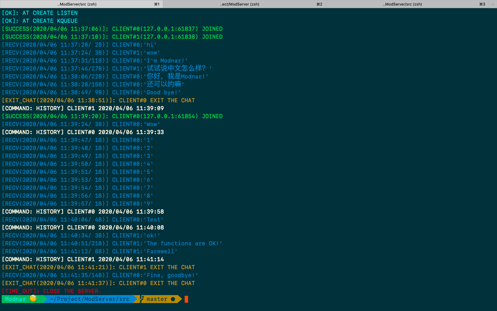
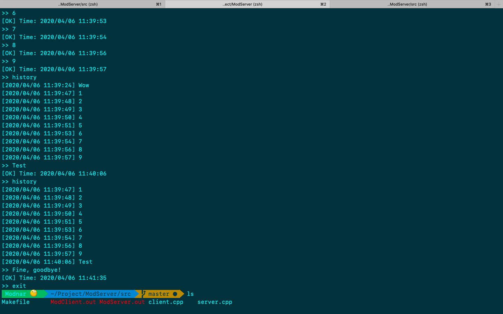

# _ModServer_

&#160; &#160; &#160; &#160; 致力于实现一个**聊天管理**的服务器，快来与 _**Modnar**_ 一起学习吧！

## 运行结果

### 运行说明

&#160; &#160; &#160; &#160; 目前所有用户发送的消息均被发送到服务器端，且不同用户间消息互不可见(当然，后续可以实现真正的聊天，思路与逻辑比较清晰)。同时，服务器端可将用户发送来的特定的字符串作为`命令`来看待，比如`history`就是一个查询该用户历史发送消息的命令。

&#160; &#160; &#160; &#160; 考虑到后续会致力于实现一个真正的“聊天室”，这里不展开叙述当前实现内容，具体内容可参考代码及下面的说明。

&#160; &#160; &#160; &#160; 关于实现一个聊天室来说，有以下几个问题需要考虑:

- 服务器端如何记录历史消息？

> 可以申请一块内存空间单独用于存储历史消息，对于这块空间的访问，可以采用高级IO来进行操作以提升效率。但缺点在于每个用户发送来消息时，均需要对该部分内容进行维护。

- 客户端如何实时获得其他用户发送的消息？

> 这里可能需要对客户端进行一个改造，即修改当前仅有的发送、接收轮次执行为监听接收，当有新消息时就进行接收并显示，这部分内容依旧可以考虑采用IO复用来实现(暂未实施，思路如此)。同时，在服务器端就需要接收到一个用户的消息后，对其他的所有连接用户均发送一份“信息的拷贝”。

### 程序截图(当前已实现部分)

&#160; &#160; &#160; &#160; 服务器端，会针对用户传来的消息以及用户的状态进行识别，这里采用终端下颜色显示以区分不同类型消息。

&#160; &#160; &#160; &#160; 客户端1，主要测试了历史消息存储(只存储该用户自己的最近10条消息)，当然，存储多少条可以进行设置，这里仅用于调试与展示。

&#160; &#160; &#160; &#160; 客户端2，用于测试并发效果，且其中包含中文内容，可以看到服务器端依旧可以正常处理(当然，存储单个中文汉字需要三个字节，这在服务器端执行结果可以看到)。

## 日志

_**2020/04/01**_

&#160; &#160; &#160; &#160; 回顾了关于网络的一些基础知识，并学习了一些socket通信函数。

_**2020/04/02**_

&#160; &#160; &#160; &#160; 学习参考书上的示例，复现了该实现代码，包括TCP数据传输、以及外带数据传输(待完善)。

_**2020/04/03**_

&#160; &#160; &#160; &#160; 读完了《Linux高性能服务器编程》，将重心放在 _chatServer_ 的实现，并开始尝试。

_**2020/04/04**_

&#160; &#160; &#160; &#160; 针对书中的一些内容，重点阅读并深入理解了一下，对于macOS下无法使用epoll进行I/O复用的问题，采取kqueue来进行实现。

_**2020/04/05**_

&#160; &#160; &#160; &#160; 调试程序，查阅关于`kqueue`、`EV_SET`、`kevent`等内容的博客经验，修改程序中的Bug：

- 文件描述符阻塞问题(在写码时忽略了将文件属性设置为O\_NONBLOCK)，使得I/O复用表现异常。

- 共享内存问题(由于一次程序非法退出，使得创建的一块共享内存未被回收，进而造成后续程序无法运行。通过在程序中先调用`shm_unlink`解决)。

- 关于kqueue的使用问题，现已实现基础功能。

&#160; &#160; &#160; &#160; 截止至2020.4.5 23:00，已修改实现思路，完全采用IO复用来实现对多个连接进行管理，已实现基本功能。

_**2020/04/06**_

&#160; &#160; &#160; &#160; 截止至2020.04.05 11:45，完成预期功能: 查询历史消息。
